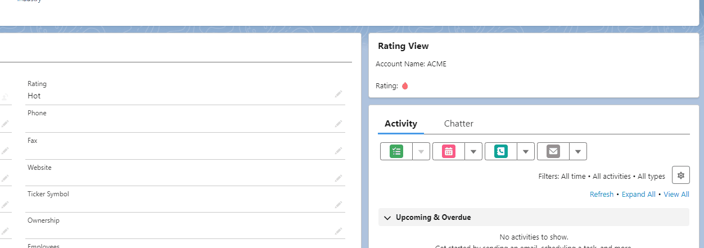

<div align="center">

<picture>
  <source media="(prefers-color-scheme: dark)" srcset="assets/expression_logo_dark.svg">
  <source media="(prefers-color-scheme: light)" srcset="assets/expression_logo_light.svg">
  
</picture>

Powerful formula-syntax evaluator for Apex and LWC.

</div>


## Features

* Supports all the most important operators and functions available in Salesforce formulas
* Support for lists and maps, including spread operator (`...`) support.
* Automatically understands relationships and can extract data from child records
* Comes with pre-built LWC component to evaluate formulas in record pages

## Installation

### Unlocked Package (`expression` namespace)

[](https://test.salesforce.com/packaging/installPackage.apexp?p0=04tDm0000011MfoIAE)
[](https://login.salesforce.com/packaging/installPackage.apexp?p0=04tDm0000011MfoIAE)

Install with SF CLI:

```shell
sf package install --apex-compile package --wait 20 --package 04tDm0000011MfoIAE
```

Install with SFDX CLI:

```shell
sfdx force:package:install --apexcompile package --wait 20 --package 04tDm0000011MfoIAE
```

### Direct Deployment to Salesforce

Clone the repo and deploy the source code, or click the button below to directly deploy to Salesforce.

[](https://githubsfdeploy.herokuapp.com/app/githubdeploy/cesarParra/formula-evaluator)

## Usage

> 📓Code samples use the `expression` namespace, which assumes you are using the 
> unlocked package.
> If you are not, you can remove the namespace prefix from the code samples.


Use `expression.Evaluator` class to evaluate formulas.

```apex
String formula = '1 + 1';
Object result = expression.Evaluator.run(formula);
Assert.areEqual(2, result);
```

You can also evaluate formulas providing an SObject Id as context. This allows you to
make reference to merge fields in the formula and the framework will take care of querying the
correct values.

> 📓 One SOQL query is consumed when using this endpoint.

```apex
Account account = new Account(Name = 'ACME');
insert account;

Object result = expression.Evaluator.run('Name', account.Id);
Assert.areEqual('ACME', result);
```

Finally, you can use evaluate formulas providing an SObject as context. This can save you a
query if you already have the SObject in memory.

When using this endpoint, the caller is in charge of providing the correct context
with the correct fields being referenced in the formula correctly queried.

```apex
Account account = new Account(Name = 'ACME');
Object result = expression.Evaluator.run('Name', account);
Assert.areEqual('ACME', result);
```

References to related (child or parent) records are also supported. 

You can reference parent relationships through dot notation:

```apex
Account parentAccount = new Account(Name = 'ACME');
insert parentAccount;

Account childAccount = new Account(Name = 'ACME Child', ParentId = parentAccount.Id);
insert childAccount;

Object result = expression.Evaluator.run('Parent.Name', childAccount);
Assert.areEqual('ACME', result);
```

You can reference fields on child data in two ways: either referencing the child list directly
to get aggregate data:

```apex
Object result = expression.Evaluator.run('SIZE(ChildAccounts)', parentAccount);
Assert.areEqual(1, result);
```

Or you can use some of the collection functions (like `MAP` or `WHERE`) to extract (or map) data out of the child records
or filter records. See more information about these functions below.

### Considerations and Limitations

There are a few limitations around merge fields at the moment

- When using the endpoint that takes a record Id as the context or fetching data through the `FETCH` function, 
the query is performed `with sharing`, so any records that the user does not have access to
will not be returned or taken into account in the operation.
- `MAP` only supports one level of relationship, so the second argument cannot contain
references to children of the child record being mapped.
- When extracting data out of child records through the MAP function, any null
value is skipped. Take this into account when computing information using list
functions.

## List Support

To work with lists, you have 2 options:

Use square brackets to create a list:

```apex
Object result = expression.Evaluator.run('[1, 2, 3]'); // (1, 2, 3)
```

or use the `LIST` function and pass as many arguments as you want:

```apex
Object result = expression.Evaluator.run('LIST(1, 2, 3)'); // (1, 2, 3)
```

## Map Support

To work with maps, you can use curly braces to create a map:

```apex
Object result = expression.Evaluator.run('{ "a": 1, "b": 2 }'); // { "a": 1, "b": 2 }
```

Keys are allowed to be any value type or even expressions:

```apex
Object result = expression.Evaluator.run('{ 1 + 1: 1, "b": 2 }'); // { 2: 1, "b": 2 }
```

Maps allow you to represent complex data structures, including nested maps and lists:

```apex
Id parentId = '0018N00000IEEK8QAP';
Object result = Evaluator.run(
    '{"Family Name": Name, "Members": { "Count": SIZE(Contacts), "Names": MAP(Contacts, Name)}}',
    parentId
);
// { "Family Name": "Doe", "Members": { "Count": 2, "Names": ["John Doe", "Jane Doe"] } }
```

## Piping

The pipe operator (`->`) allows you to chain operations together. The result of the previous operation
is passed as the first argument to the next operation.

This allows you to "flip" your code, where `a(b)` becomes `b -> a()`.

Why would you use it?

Consider a chain of operations like this:

```
WHERE(WHERE([1, 2, 3, 4, 5, 6], $current > 2), $current < 5)
```

This is slightly hard to read, and it's easy to get lost in the parenthesis. With piping, you can
write it like this:

```
[1, 2, 3, 4, 5, 6]
    -> WHERE($current > 2)
    -> WHERE($current < 5) 
```

This works when working with record data as well. These 2 are equivalent:

```apex
Evaluator.run('MAP(WHERE(WHERE(ChildAccounts, NumberOfEmployees > 10), AnnualRevenue > 200), Name)', recordId);

Evaluator.run(
    'ChildAccounts ' +
    '-> WHERE(AnnualRevenue > 200) ' +
    '-> WHERE(NumberOfEmployees > 10) ' +
    '-> MAP(Name)', 
    recordId);
```
## Fetching Data from the Database

A special function, `FETCH`, is provided which allows you to query data from the database. This is useful
when the data you want to use is not provided as part of the context.

The `FETCH` function takes 2 arguments: a string with the `SOjectName` you wish to extract data from,
and a list of strings with the fields you wish to extract. This will query all the records of the given
type and return a list of `SObjects` with the data.

```apex
Object result = expression.Evaluator.run('FETCH("Account", ["Id", "Name"])');
```

This can be combined with other collection functions like `MAP` and `WHERE` to filter or map the data.

```apex
Object result = expression.Evaluator.run('MAP(WHERE(FETCH("Account", ["Id", "Name"]), Name = "ACME"), Id)');
```

Note that when using this function, the automatic context resolution is not performed, so you need to
explicitly specify all fields you wish to reference in the formula.

At this moment advanced querying capabilities like filtering, sorting, or limiting the number of records
are not supported. To get over these limitations, you can create a custom formula using Apex. See the
[Advanced Usage](#advanced-usage) section for more information.

## Advanced Usage

### Custom Formula Functions

You can create your own custom formula functions by implementing the `expression.IExpressionFunction` interface.
This interface has a single method, `Object run(List<Object> args)`, which receives the arguments passed to the
function (if any) and returns the result.

```apex
global class MyCustomFunction implements expression.IExpressionFunction {
    global Object run(List<Object> args) {
        // Do something with the arguments and return the result
    }
}
```

To register your custom function, you need to create a new Custom Metadata record of type `Expression Function`
and specify the name of the function and the Apex class that implements it:

* Go to `Setup > Custom Metadata Types` and click `Manage Records` next to `Expression Function`
* Click `New` and enter the name of your function and the Apex class that implements it
* Click `Save`
* Your function is now available to use in formulas using the name you specified

## Supported Operators and Functions

### Operators

#### Math Operators

- `+` Addition

```apex
expression.Evaluator.run('1 + 1'); // 2
```

- `-` Subtraction

```apex
expression.Evaluator.run('1 - 1'); // 0
```

- `*` Multiplication

```apex
expression.Evaluator.run('2 * 2'); // 4
```

- `/` Division

```apex
expression.Evaluator.run('4 / 2'); // 2
```

- `^` Exponentiation

```apex
expression.Evaluator.run('2 ^ 2'); // 4
```

#### Misc

- `( )` Parentheses

Groups expressions together.

```apex
expression.Evaluator.run('(1 + 1) * 2'); // 4
```

- `->` Pipe

Read more about piping [here](#piping).

```apex
expression.Evaluator.run('[1, 2, 3] -> MAP($current + 1)'); // (2, 3, 4)
```

#### Logical Operators

- `=` and `==` Equal

Evaluates if two values are equal. The `=` and `==` operators are equivalent.

```apex
expression.Evaluator.run('1 = 1'); // true
```

- `<>` and `!=` Not Equal

Evaluates if two values are not equal. The `<>` and `!=` operators are equivalent.

```apex
expression.Evaluator.run('1 <> 2'); // true
```

- `<` Less Than

Evaluates if the first value is less than the second value.

```apex
expression.Evaluator.run('1 < 2'); // true
```

- `>` Greater Than

Evaluates if the first value is greater than the second value.

```apex
expression.Evaluator.run('2 > 1'); // true
```

- `<=` Less Than or Equal

Evaluates if the first value is less than or equal to the second value.

```apex
expression.Evaluator.run('1 <= 1'); // true
```

- `>=` Greater Than or Equal

Evaluates if the first value is greater than or equal to the second value.

```apex
expression.Evaluator.run('1 >= 1'); // true
```

- `&&` Logical AND

Evaluates if both values are true.

```apex
expression.Evaluator.run('true && true'); // true
```

- `||` Logical OR

Evaluates if either value is true.

```apex
expression.Evaluator.run('true || false'); // true
```

#### String Operators

- `&` and `+` Concatenation

Concatenates two strings together. The `&` and `+` operators are equivalent.

```apex
expression.Evaluator.run('"Hello" & " " & "World"'); // "Hello World"
```

#### List and Map Operators

- `...` Spread Operator

When used within a list, it expands the list into its elements.

```apex
expression.Evaluator.run('LIST(1, 2, 3, ...LIST(4, 5, 6))'); // (1, 2, 3, 4, 5, 6)
expression.Evaluator.run('[1, 2, 3, ...[4, 5, 6]]'); // (1, 2, 3, 4, 5, 6)
```

When using within a map it expands the map into its key-value pairs.

```apex
expression.Evaluator.run('{ "a": 1, "b": 2, ...{ "c": 3, "d": 4 } }'); // { "a": 1, "b": 2, "c": 3, "d": 4 }
```

### Functions

#### Logical Functions

- `AND`

Returns a TRUE response if all values are true; returns a FALSE response if one or more values are false.

Accepts multiple arguments, but must have at least 2.

```apex
expression.Evaluator.run('AND(true, true)'); // true
expression.Evaluator.run('AND(true, false, true)'); // false
```

- `IF`

Returns one value if a condition is true and another value if it's false.

Accepts 3 arguments: the condition, the value if true, and the value if false.

```apex
expression.Evaluator.run('IF(true, "Hello", "World")'); // "Hello"
expression.Evaluator.run('IF(false, "Hello", "World")'); // "World"
```

- `NOT`

Reverses the logical value of its argument.

```apex
expression.Evaluator.run('NOT(true)'); // false
```

- `OR`

Returns a TRUE response if any value is true; returns a FALSE response if all values are false.

Accepts any number of arguments.

```apex
expression.Evaluator.run('OR(true, false)'); // true
expression.Evaluator.run('OR(false, false)'); // false
```

- `BLANKVALUE`

Returns a specified value if the expression is blank (null value or empty string); otherwise, returns the result of the
expression.

Accepts 2 arguments: the expression and the value to return if the expression is blank.

```apex
expression.Evaluator.run('BLANKVALUE(null, "Hello")'); // "Hello"
expression.Evaluator.run('BLANKVALUE("World", "Hello")'); // "World"
```

- `ISBLANK`

Returns TRUE if the expression is blank (null value or empty string); otherwise, returns FALSE.

Accepts 1 argument: the expression to check.

```apex
expression.Evaluator.run('ISBLANK(null)'); // true
expression.Evaluator.run('ISBLANK("")'); // true
expression.Evaluator.run('ISBLANK("Hello")'); // false
```

- `CASE`

Compares a given expression to a set of values. If the expression matches a value, the corresponding value is returned,
otherwise the default value is returned.

Accepts any number of arguments where the first is the expression to evaluate, the last is the "else" case
and in between each pair of arguments is a value to compare against and the value to return if the expression matches.
Format: `CASE(expression,value1, result1, value2, result2,..., else_result)`

```apex
Account testAccount = new Account(Rating = 'Hot');
Object result = expression.Evaluator.run(
    'CASE(Rating, "Hot", "🔥", "Cold", "🧊", "🤷")', 
    testAccount); // "🔥"
```

- `ISNUMBER`

Returns TRUE if the expression is a number; otherwise, returns FALSE.

Accepts 1 argument: the expression to check.

```apex
expression.Evaluator.run('ISNUMBER(1)'); // true
expression.Evaluator.run('ISNUMBER("Hello")'); // false
```

#### String Functions

- `BEGINS`

Returns TRUE if the first character(s) in a text field match a given string.

Accepts 2 arguments: the text field and the string to match.

```apex
expression.Evaluator.run('BEGINS("Hello World", "Hello")'); // true
```

- `CONTAINS`

Returns TRUE if a text field contains a given string.

Accepts 2 arguments: the text field and the string to match.

```apex
expression.Evaluator.run('CONTAINS("Hello World", "llo Wo")'); // true
```

- `LOWER`

Converts all letters in the specified text to lowercase.

Accepts 1 argument: the text to convert.

```apex
expression.Evaluator.run('LOWER("Hello World")'); // "hello world"
```

- `FIND`

Returns the starting position of one text string within another text string. If the text string is not found, FIND
returns a value -1.

Accepts either 2 or 3 arguments: the text to find, the text to search, and optionally the starting position.

```apex
expression.Evaluator.run('FIND("World", "Hello World")'); // 6
expression.Evaluator.run('FIND("World", "Hello World", 7)'); // -1
```

- `LEFT`

Returns the specified number of characters from the beginning of a text string.

Accepts 2 arguments: the text to evaluate and the number of characters to return.

```apex
expression.Evaluator.run('LEFT("Hello World", 5)'); // "Hello"
```

- `LEN`

Returns the number of characters in a text string.

Accepts 1 argument: the text to evaluate.

```apex
expression.Evaluator.run('LEN("Hello World")'); // 11
```

- `LPAD`

Returns a text value padded to the specified length with the specified set of characters.

Accepts 2 or 3 arguments: the text to pad, the length to pad to, and optionally the padding character.
If the padding character is not specified, it defaults to a space.

```apex
expression.Evaluator.run('LPAD("Hello", 10)'); // "     Hello"
expression.Evaluator.run('LPAD("Hello", 10, "*")'); // "*****Hello"
```

- `RPAD`

Returns a text value padded to the specified length with the specified set of characters.

Accepts 2 or 3 arguments: the text to pad, the length to pad to, and optionally the padding character.
If the padding character is not specified, it defaults to a space.

```apex
expression.Evaluator.run('RPAD("Hello", 10)'); // "Hello     "
expression.Evaluator.run('RPAD("Hello", 10, "*")'); // "Hello*****"
```

- `REVERSE`

Returns a text value with the order of the characters reversed.

Accepts 1 argument: the text to reverse.

```apex
expression.Evaluator.run('REVERSE("Hello World")'); // "dlroW olleH"
```

- `MID`

Returns a specified number of characters from a text string starting at the position you specify up
to the number of characters you specify.

Note that the position is 1-based, not 0-based.

Accepts 3 arguments: the text to evaluate, the starting position, and the number of characters to return.

```apex
expression.Evaluator.run('MID("Hello World", 7, 5)'); // "World"
```

- `SUBSTRING`

Returns a specified number of characters from a text string starting at the position you specify.
Optionally, you can specify the number of characters to return.

Note that the position is 1-based, not 0-based.

Accepts 2 or 3 arguments: the text to evaluate and the starting position. Optionally, the number of characters to

```apex
expression.Evaluator.run('SUBSTRING("Hello World", 7)'); // "World"
expression.Evaluator.run('SUBSTRING("Hello World", 7, 5)'); // "World"
```

- `RIGHT`

Returns the specified number of characters from the end of a text string.

Accepts 2 arguments: the text to evaluate and the number of characters to return.

If the second argument is a negative number, it gets treated as a 0

```apex
expression.Evaluator.run('RIGHT("Hello World", 5)'); // "World"
expression.Evaluator.run('RIGHT("Hello World", -5)'); // ""
```

- `BR`

Inserts a line break in a string of text.

When no arguments are provided, it inserts a line break. When a number is provided, it inserts that number of line

⚠️ Note that the inserted line break depends on the call context based on the [Request Quiddity](https://developer.salesforce.com/docs/atlas.en-us.apexref.meta/apexref/apex_enum_System_Quiddity.htm). When called from
    an Aura/LWC or Visualforce context it will insert a `<br>` tag, otherwise it will insert a newline character.

```apex
expression.Evaluator.run('BR()'); // "\n" or "<br>"
expression.Evaluator.run('BR(2)'); // "\n\n" or "<br><br>"
```

- `HYPERLINK`

Returns a text string of an HTML anchor tag that displays a hyperlink.

Accepts 2 or 3 arguments: the URL and the text to display. Optionally, the third argument is the target
of the link.

The target should be one of `_blank`, `_parent`, `_self`, or `_top`.

```apex
expression.Evaluator.run('HYPERLINK("https://www.google.com", "Google")'); // "<a href="https://www.google.com">Google</a>"
expression.Evaluator.run('HYPERLINK("https://www.google.com", "Google", "_blank")'); // "<a href="https://www.google.com" target="_blank">Google</a>"
```

- `SUBSTITUTE`

Substitutes new text for old text in a text string.

Accepts 3 arguments: the text to evaluate, the text to replace, and the text to replace it with.

```apex
expression.Evaluator.run('SUBSTITUTE("Hello World", "World", "Universe")'); // "Hello Universe"
```

- `TEXT`

Converts the received argument to a string.

Accepts 1 argument: the value to convert to a string.

```apex
expression.Evaluator.run('TEXT(1)'); // "1"
```

- `TRIM`

Removes the spaces and tabs from the beginning and end of a text string.

Accepts 1 argument: the text to trim.

```apex
expression.Evaluator.run('TRIM(" Hello World ")'); // "Hello World"
```

- `UPPER`

Converts all letters in the specified text to uppercase.

Accepts 1 argument: the text to convert.

```apex
expression.Evaluator.run('UPPER("Hello World")'); // "HELLO WORLD"
```

#### Date and Time Functions

- `DATE`

Returns a date value from the provided year, month, and day values.

Accepts 3 arguments: the year, month, and day.

```apex
expression.Evaluator.run('DATE(2020, 1, 1)'); // 2020-01-01 00:00:00
```

- `ADDMONTHS`

Returns a date that is a specified number of months before or after a given date.

Accepts 2 arguments: the date and the number of months to add.

```apex
expression.Evaluator.run('ADDMONTHS(DATE(2020, 1, 1), 1)'); // 2020-02-01 00:00:00
```

- `DAY`

Returns the day of the month, a number from 1 to 31.

Accepts 1 argument: the date to evaluate.

```apex
expression.Evaluator.run('DAY(DATE(2020, 1, 1))'); // 1
```

- `DAYOFYEAR`

Returns the day of the year, a number from 1 to 366.

Accepts 1 argument: the date to evaluate.

```apex
expression.Evaluator.run('DAYOFYEAR(DATE(2020, 1, 1))'); // 1
```

- `NOW`

Returns the current Datetime in the GMT time zone.

Accepts no arguments.

```apex
expression.Evaluator.run('NOW()'); // 2020-01-01 00:00:00
```

- `DATEVALUE`

Returns a date value from a string representation of a date or 
a datetime.

Accepts 1 argument: the date as a string or datetime.

```apex
expression.Evaluator.run('DATEVALUE("2020-01-01")'); // 2020-01-01 00:00:00
expression.Evaluator.run('DATEVALUE(NOW())'); // 2020-01-01 00:00:00
```

- `DATETIMEVALUE`

Returns a datetime value from a string representation of a date.

Accepts 1 argument: the date as a string.

```apex
expression.Evaluator.run('DATETIMEVALUE("2020-01-01")'); // 2020-01-01 00:00:00
```

- `TODAY`

Returns the current date.

Accepts no arguments.

```apex
expression.Evaluator.run('TODAY()'); // 2020-01-01
```

- `TIMEVALUE`

Returns a time value from a datetime or from a string representation of a datetime.

Accepts 1 argument: the datetime or string in datetime format to evaluate.

```apex
expression.Evaluator.run('TIMEVALUE(DATETIMEVALUE("2020-01-01 12:00:00"))'); // 12:00:00
expression.Evaluator.run('TIMEVALUE("17:30:45.125")'); // 17:30:45.125
```

- `TIMENOW`

Returns the current time.

Accepts no arguments.

```apex
expression.Evaluator.run('TIMENOW()'); // 12:00:00
```

- `ISOWEEK`

Returns the ISO week number of the year for a given date.

Accepts 1 argument: the date to evaluate.

```apex
expression.Evaluator.run('ISOWEEK(DATE(2020, 1, 1))'); // 1
```

- `ISOYEAR`

Returns the ISO year number for a given date.

Accepts 1 argument: the date to evaluate.

```apex
expression.Evaluator.run('ISOYEAR(DATE(2020, 1, 1))'); // 2020
```

- `YEAR`

Returns the year value of a provided date.

Accepts 1 argument: the date to evaluate.

```apex
expression.Evaluator.run('YEAR(DATE(2020, 1, 1))'); // 2020
```

- `MILLISECOND`

Returns the millisecond value of a provided time.

Accepts 1 argument: the time to evaluate.

```apex
expression.Evaluator.run('MILLISECOND(TIMEVALUE("12:00:00.123"))'); // 123
```

- `MINUTE`

Returns the minute value of a provided time.

Accepts 1 argument: the time to evaluate.

```apex
expression.Evaluator.run('MINUTE(TIMEVALUE("12:10:00"))'); // 10
```

- `SECOND`

REturns the second value of a provided time.

Accepts 1 argument: the time to evaluate.

```apex
expression.Evaluator.run('SECOND(TIMEVALUE("12:00:45"))'); //45
```

- `HOUR`

Returns the hour value of a provided time.

Accepts 1 argument: time to evaluate.

```apex
expression.Evaluator.run('HOUR(TIMEVALUE("12:00:00"))'); // 12
```

- `UNIXTIMESTAMP`

Returns the number of seconds since 1 Jan 1970 for the given date or datetime,
or number of seconds in the day for a time.

Values are returned in the GMT time zone.

Accepts 1 argument: the date, datetime, or time to evaluate.

```apex
expression.Evaluator.run('UNIXTIMESTAMP(DATE(2020, 1, 1))'); // 1577836800
expression.Evaluator.run('UNIXTIMESTAMP(DATETIMEVALUE("2020-01-01 12:00:00"))'); // 1577880000
expression.Evaluator.run('UNIXTIMESTAMP(TIMEVALUE("12:00:00"))'); // 43200
```

- `WEEKDAY`

Returns the day of the week for a given date.

Accepts 1 argument: the date to evaluate.

```apex
expression.Evaluator.run('WEEKDAY(DATE(2020, 1, 1))'); // 4
```

#### List Functions

- `MAP`

Maps to a list using the first argument as the context and the second argument as the expression to evaluate.

Accepts 2 arguments: List of objects and an expression to evaluate.

> In the inner expression, you have access to 3 special variables: `$index` (the index of the current
> record in the list), `$current` (the current item being iterated over), and `$total` (the total number
> of items in the list).

```apex
Object result = expression.Evaluator.run('MAP(["a", "b", "c"], UPPER($current))'); // ["A", "B", "C"]
```

To work with child records, you can specify the child relationship name as the first argument, and then the expression to evaluate on each
child item as the second argument.

> When referencing child data through the record Id endpoint, the framework will take care of any necessary
> subqueries, so only one SOQL query is consumed.

This expression can be anything, something as simple as extracting a single field:

```apex
Object result = expression.Evaluator.run('MAP(ChildAccounts, Name)', parentAccountRecordOrId);
Assert.areEqual('[ACME Child, Another Child]', result);
```

To as complex as building a map with multiple fields that even references the parent record:

```apex
Object result = expression.Evaluator.run('MAP(ChildAccounts, { "Number": $index + 1, "Name": Name, "Parent Name": Parent.Name })', parentAccount);
// [{ "Number": 1, "Name": "ACME Child", "Parent Name": "ACME" }]
```

This can be combined with list operations to extract aggregate information out
of child records.

```apex
Account parentAccountWithChildren = [SELECT Id, Name, (SELECT Id, NumberOfEmployees FROM ChildAccounts) FROM Account WHERE Id = :parentAccount.Id];
Object result = expression.Evaluator.run('AVERAGE(MAP(ChildAccounts, NumberOfEmployees))', parentAccountWithChildren); // 10
```

- `WHERE`

Filters a list using the first argument as the context and the second argument as the expression to evaluate.

Accepts 2 arguments: List of objects and an expression to evaluate.

> In the inner expression, you have access to 3 special variables: `$index` (the index of the current
> record in the list), `$current` (the current item being iterated over), and `$total` (the total number
> of items in the list).

```apex
Object result = expression.Evaluator.run('WHERE([1, 2, 3], $current > 1)'); // [2, 3]
```

Everything that applies to `MAP` also applies here as well, including the ability to reference child data.

- `AVERAGE`

Returns the average given a list of numbers.

Accepts 1 argument: the list of numbers to evaluate.

```apex
expression.Evaluator.run('AVERAGE(LIST(1, 2, 3))'); // 2
```

- `MAX` and `MIN`

#### Map Functions

- `KEYS`

Returns a list of keys in a map.

Accepts 1 argument: the map to evaluate.

```apex
expression.Evaluator.run('KEYS({ "a": 1, "b": 2, "c": 3 })'); // ["a", "b", "c"]
```

- `GET`

Returns the value of a key in a map.

Accepts 2 arguments: the map to evaluate and the key to get.

```apex
expression.Evaluator.run('GET({ "a": 1, "b": 2, "c": 3 }, "b")'); // 2
```

- `VALUES`

Returns a list of values in a map.

Accepts 1 argument: the map to evaluate.

```apex
expression.Evaluator.run('VALUES({ "a": 1, "b": 2, "c": 3 })'); // [1, 2, 3]
```

#### Lists and Maps Functions

Functions that work with both lists and maps.

- `SIZE`

Returns the number of elements in a list or map.

Accepts 1 argument: the list or map to evaluate.

```apex
expression.Evaluator.run('SIZE(LIST(1, 2, 3))'); // 3
expression.Evaluator.run('SIZE({ "a": 1, "b": 2, "c": 3 })'); // 3
```

- `ISEMPTY`

Returns true if the list or map is empty.

Accepts 1 argument: the list or map to evaluate.

```apex
expression.Evaluator.run('ISEMPTY(LIST(1, 2, 3))'); // false
expression.Evaluator.run('ISEMPTY({ "a": 1, "b": 2, "c": 3 })'); // false
expression.Evaluator.run('ISEMPTY(LIST())'); // true
expression.Evaluator.run('ISEMPTY({})'); // true
```

- `APPEND`

Appends an element to a list.

Accepts 2 arguments: the list to append to and the element to append.

```apex
expression.Evaluator.run('APPEND([1, 2, 3], 4)'); // (1, 2, 3, 4)
```

- `REVERSE`

Reverses a list.

Accepts 1 argument: the list to reverse.

```apex
expression.Evaluator.run('REVERSE([1, 2, 3])'); // (3, 2, 1)
```

- `DISTINCT`

Returns a list of unique values.

Accepts 1 argument: the list to evaluate.

```apex
expression.Evaluator.run('DISTINCT([1, 2, 3, 1, 2, 3])'); // (1, 2, 3)
```

- `SORT`

Sorts a list.

Accepts at least one argument: the list to sort.
When sorting a list of Maps or a list of SObjects,
two additional arguments can be provided: the field to sort by and the sort direction.

The field to sort can either be a field name as a merge field (field name without quotes), or an expression that evaluates to a string
representing the field name. Merge fields are only supported when sorting SObjects and are useful to get the framework to automatically
query the field for you.

> The merge field must be a field on the SObject being sorted itself, not a relationship field.

The sort direction can either be the literal string (requires quotes) `ASC` or `DESC`.

```apex
expression.Evaluator.run('SORT([3, 2, 1])'); // (1, 2, 3)
expression.Evaluator.run('SORT([{ "a": 3 }, { "a": 2 }, { "a": 1 }], "a")'); // ({ "a": 1 }, { "a": 2 }, { "a": 3 })
expression.Evaluator.run('SORT([{ "a": 3 }, { "a": 2 }, { "a": 1 }], "a", "DESC")'); // ({ "a": 3 }, { "a": 2 }, { "a": 1 })
expression.Evaluator.run('FETCH("Account", ["Name"]) -> SORT("Name")'); // ({"Name": "ACME"}, {"Name": "Another Account"})
expression.Evaluator.run('SORT(ChildAccounts, NumberOfEmployees, "asc")', parentAccount.Id); // ({"NumberOfEmployees": 1}, {"NumberOfEmployees": 2})
```

#### Math Functions

- `ABS`

Returns the absolute value of a number.

Accepts 1 argument: the number to evaluate.

```apex
expression.Evaluator.run('ABS(-1)'); // 1
```

- `CEILING`

Returns the smallest integer greater than or equal to the specified number.

Accepts 1 argument: the number to evaluate.

```apex
expression.Evaluator.run('CEILING(1.5)'); // 2
```

- `FLOOR`

Returns the largest integer less than or equal to the specified number.

Accepts 1 argument: the number to evaluate.

```apex
expression.Evaluator.run('FLOOR(1.5)'); // 1
```

- `FROMUNIXTIME`

Returns the GMT Datetime from a Unix timestamp.

Accepts 1 argument: the Unix timestamp to evaluate.

```apex
expression.Evaluator.run('FROMUNIXTIME(1577836800)'); // 2020-01-01 00:00:00
```

- `MAX`

Returns the largest of one or more numbers.

Accepts either a list of numbers as a single argument, or multiple numerical arguments.

```apex
expression.Evaluator.run('MAX(LIST(1, 2, 3))'); // 3
expression.Evaluator.run('MAX(1, 2, 3)'); // 3
```

- `MIN`

Returns the smallest of one or more numbers.

Accepts either a list of numbers as a single argument, or multiple numerical arguments.

```apex
expression.Evaluator.run('MIN(LIST(1, 2, 3))'); // 1
expression.Evaluator.run('MIN(1, 2, 3)'); // 1
```

- `ROUND`

Returns a rounded number. Optionally specify the number of decimal places to round to.

Accepts 1 or 2 arguments: the number to round and optionally the number of decimal places to round to.

```apex
expression.Evaluator.run('ROUND(1.5)'); // 2
expression.Evaluator.run('ROUND(1.5, 1)'); // 1.5
```

- `TRUNC`

Returns a truncated number. Optionally specify the number of decimal places to truncate to.

Accepts 1 or 2 arguments: the number to truncate and optionally the number of decimal places to truncate to.

```apex
expression.Evaluator.run('TRUNC(1.5)'); // 1
expression.Evaluator.run('TRUNC(1.5, 1)'); // 1.5
```

---

# Expression Components

`Expression Components` is a UI library included that can be deployed independently of the core library.
These components give you powerful configuration abilities, as their configuration properties are powered
by the `Expression` language.

## Installation

### Unlocked Package (`expression` namespace)

[](https://test.salesforce.com/packaging/installPackage.apexp?p0=04tDm0000011MftIAE)
[](https://login.salesforce.com/packaging/installPackage.apexp?p0=04tDm0000011MftIAE)

Install with SF CLI:

```shell
sf package install --apex-compile package --wait 20 --package 04tDm0000011MftIAE
```

Install with SFDX CLI:

```shell
sfdx force:package:install --apexcompile package --wait 20 --package 04tDm0000011MftIAE
```

## Components

### Formula

The `Formula` component allows you to evaluate an expression and display the result. It can be used
in a record page or in a community page.

When using in a record page, the record Id is automatically used as the context of the expression.

When using in a community page, you can optionally specify the context by setting the `Record Id` property. This can
receive the record Id directly or in the form of a merge field, e.g. `{!recordId}` which will be replaced
with the value of the `recordId` URL parameter.

> Keep in mind that if a record Id is not specified, the expression provided should not contain any merge field
references.

#### Properties

- `Record Id` - The record Id to use as the context of the expression. This can be a merge field, e.g. `{!recordId}`. Only
    used when the component is used in a community page.
- `Title` - The card title.
- `Formula Expression` - The expression to evaluate.

#### Sample Usage
Placing the component in an Account page and using the following formula:

```bash
"Account Name: " + Name + BR(2) + "Rating: " + CASE(Rating, "Hot", "🔥", "Cold", "🧊", "🤷")
```

Results in the following. Note that the component reacts to changes in the record and updates
itself based on the new values when placed in a record page.



### Nav Bar

The `Nav Bar` component allows you to display a navigation bar with links to other pages. It can be used
in a community page.

#### Properties

- `Formula Expression` - The expression to evaluate. This expression should evaluate to a map with the following format:

```json
{
  "logo": {
    "name": <<String value or expression>>,
    "url": <<String value or expression>>
  },
  "menuItems": [
    {
      "label": <<String value or expression>>,
      "url": <<String value or expression>>
    }
  ],
  "callToAction": {
    "label": <<String value or expression>>,
    "url": <<String value or expression>>
  }
}
```

> The `callToAction` property is optional.

#### Sample Usage
The following formula can be used to query for Navigation Menu Items and display them in the Nav Bar component:

```bash
{
	"logo": {
		"name": "Example",
		"imagePath": "https://example.com/img/logos/primary.svg",
		"url": "/"
	},
	"menuItems": FETCH("NavigationMenuItem", ["Label", "Target", "Status", "Position"]) 
		-> WHERE(Status = "Live") 
		-> SORT("Position")
		-> MAP({
			"label": Label,
			"url": Target
		}),
	"callToAction": {
		"label": "Contact Us",
		"url": "/contact"
	}
}
```

## Contributing

Contributions are welcome! Feel free to open an issue or submit a pull request.

### Setup

Create a scratch org by running:

```bash
sfdx force:org:create -f config/dev.json -a formula-evaluator -s
```

Then push the source to the scratch org:

```bash
sfdx force:source:push
```

#### Debugging

While debugging, you might find it helpful to see the generated AST for
a given expression.

The source code includes a `Visitor` implementation
whose sole purpose is to do this, `AstPrinter`. When enabled, it will
print the AST to the logs.

You can enable it by setting the `expression.Evaluator.printAst` static variable to `true`.

```apex
expression.Evaluator.printAst = true;
Object value = expression.Evaluator.run('AND(true, false, 1=1)');
// Outputs to the logs:
// (AND true false (= 1 1))
```

### Running tests

Run the tests with:

```bash
sfdx force:apex:test:run
```
